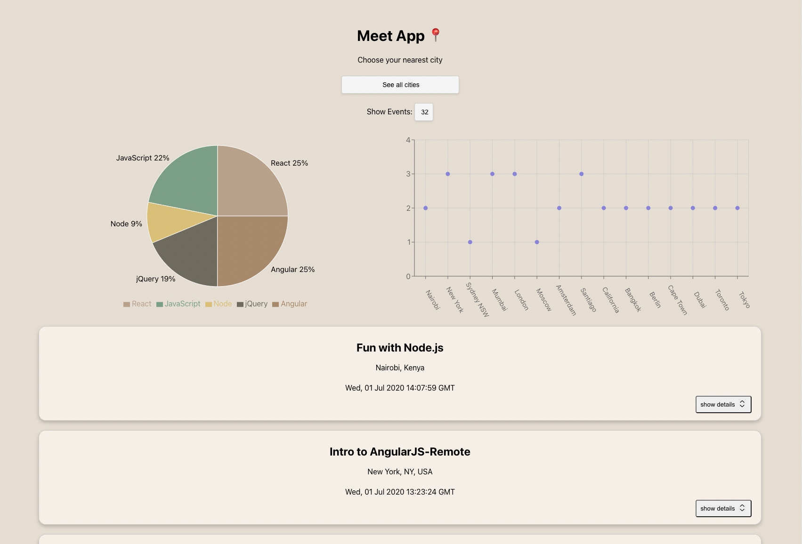

  

# 📅 Meet App

Welcome to the Meet App project! This serverless progressive web application (PWA) is built with React using a test-driven development (TDD) technique. The app utilizes the Google Calendar API to fetch upcoming events based on user preferences.

## 📝 Project Description

Meet App aims to provide users with a seamless experience for discovering and managing upcoming events in various cities. Leveraging serverless architecture and PWAs, the app offers instant loading, offline support, and cross-platform compatibility. With a focus on TDD, the codebase is thoroughly tested to ensure high-quality and reliable functionality.

## ✨ Features

- Filter events by city.
- Show/hide event details.
- Specify the number of events to display.
- Offline support with service worker.
- Add app shortcut to the home screen.
- Data visualization with charts for event details.

## 🛠️ Technical Requirements

- React application developed with TDD technique.
- Integration with Google Calendar API and OAuth2 authentication.
- Serverless functions (preferably AWS Lambda) for the authorization server.
- Hosted on GitHub Pages.
- Responsive design for all screen sizes.
- Pass Lighthouse's PWA checklist.
- Offline support with service worker.
- Ability to install the app on desktop and add to home screen on mobile.
- Test coverage >= 90% with unit, integration, and end-to-end tests.
- Monitoring with an online performance monitoring tool.

## 🚀 Getting Started

To run this project locally, follow these steps:

1. **Clone this repository:** Clone this repository to your local machine.
2. **Install dependencies:** Navigate to the project folder and run `npm install`.
3. **Start the development server:** Run `npm start` to start the development server.
4. **View the app:** Open your browser and navigate to http://localhost:3000/ to view the app.

## 📚 Documentation

The documentation for this project includes user stories, test scenarios, and detailed technical documentation. Test coverage reports and performance monitoring results are also provided.

## 🤝 Contributing

Contributions are welcome! If you have any suggestions or improvements, feel free to fork this repository and submit a pull request.

## 📄 License

This project is licensed under the MIT License - see the [LICENSE](LICENSE) file for details.
